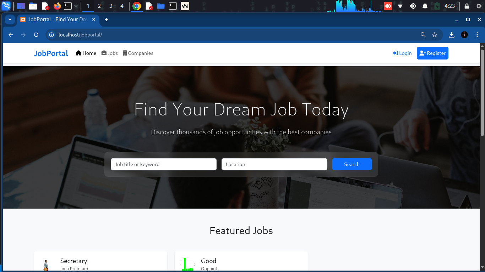
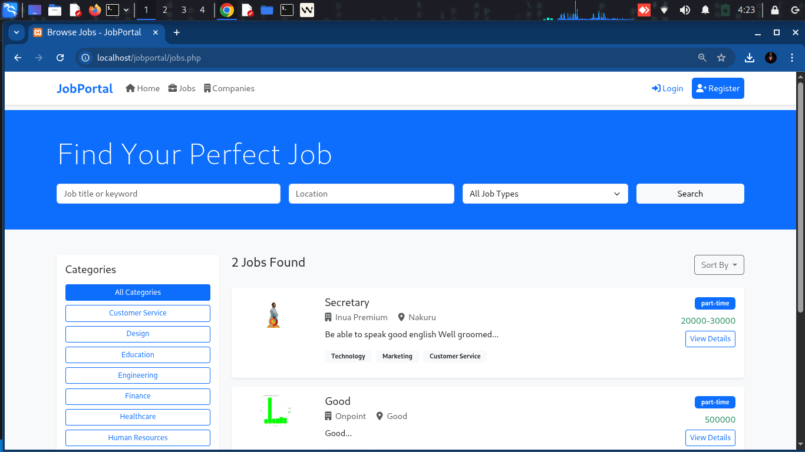
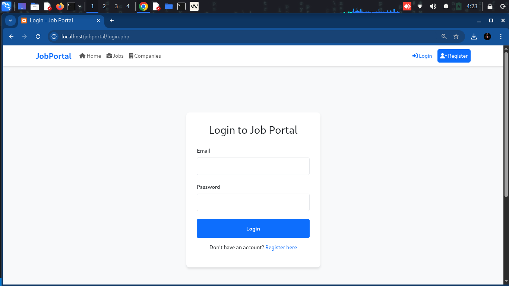

# Job Portal Web Application 🚀

[](https://github.com/yourusername/jobportal/stargazers)
[](https://github.com/yourusername/jobportal/network/members)
[](https://github.com/yourusername/jobportal/issues)
[](https://opensource.org/licenses/MIT)

A modern, feature-rich job portal web application built with PHP, MySQL, and modern web technologies. This platform bridges the gap between job seekers and employers, offering a seamless recruitment experience with powerful search capabilities and real-time updates.

## 📊 Project Stats

<div align="center">
  
  
</div>

## ✨ Key Features

### For Job Seekers
- User registration and authentication
- Create and manage professional profiles
- Search for jobs with advanced filters
- Apply for jobs with a single click
- Save jobs for later viewing
- Track application status
- Receive real-time notifications

### For Recruiters
- Company profile management
- Post and manage job listings
- View and manage job applications
- Shortlist candidates
- Contact applicants directly

## 🛠️ Technical Stack

### Frontend
- HTML5, CSS3, JavaScript (ES6+)
- Responsive Design (Mobile-first approach)
- AJAX for seamless data loading
- Bootstrap 5 for UI components

### Backend
- PHP 8.0+
- MySQL 5.7+ (InnoDB)
- Apache/Nginx web server
- RESTful API architecture

### Development Tools
- Git for version control
- Composer for dependency management
- PHP_CodeSniffer for code quality
- GitHub Actions for CI/CD

- Frontend: HTML5, CSS3, JavaScript
- Backend: PHP
- Database: MySQL
- Additional: Font Awesome for icons

## Setup Instructions

1. **Database Setup**
   ```sql
   -- Create and import the database schema
   mysql -u root -p < database/schema.sql
   ```

2. **Configuration**
   - Update database credentials in `config/database.php`
   ```php
   define('DB_HOST', 'your_host');
   define('DB_USER', 'your_username');
   define('DB_PASS', 'your_password');
   define('DB_NAME', 'jobportal');
   ```

3. **Server Requirements**
   - PHP 7.4 or higher
   - MySQL 5.7 or higher
   - Apache/Nginx web server
   - mod_rewrite enabled (for Apache)

4. **File Permissions**
   - Ensure the `uploads` directory has write permissions
   ```bash
   chmod 755 uploads/
   ```

## Directory Structure

```
jobportal/
├── api/                # API endpoints
├── config/            # Configuration files
├── css/              # Stylesheets
├── database/         # Database schema and migrations
├── images/           # Image assets
├── includes/         # Common PHP includes
├── js/              # JavaScript files
├── uploads/          # User uploaded files
└── README.md        # This file
```

## Security Features

- Password hashing using PHP's password_hash()
- Prepared statements for database queries
- Session-based authentication
- Input validation and sanitization
- CSRF protection
- XSS prevention

## Screenshots

### Home Page


### Job Search


### User Login


## 🤝 Contributing

We welcome contributions from the community! To contribute to this project:

1. Fork the repository
2. Create a feature branch (`git checkout -b feature/AmazingFeature`)
3. Commit your changes (`git commit -m 'Add some AmazingFeature'`)
4. Push to the branch (`git push origin feature/AmazingFeature`)
5. Open a Pull Request

Please read [CONTRIBUTING.md](CONTRIBUTING.md) for details on our code of conduct and the process for submitting pull requests.

## 📄 License

Distributed under the MIT License. See `LICENSE` for more information.

## 📫 Contact

Project Link: [https://github.com/OnpointSoftwares/jobportal](https://github.com/OnpointSoftwares/jobportal)

## 🙏 Acknowledgments

- [Font Awesome](https://fontawesome.com/) for the awesome icons
- [Bootstrap](https://getbootstrap.com/) for the responsive design framework
- [GitHub Readme Stats](https://github.com/OnpointSoftwares/github-readme-stats) for the stats cards
